# Vue電商數據可視化網站(ECharts)

製作並記錄筆記

# 線上DEMO

建構中

https://ivesshe.github.io/Vue_ECharts/

# ECharts

https://echarts.apache.org/zh/index.html

下載

https://github.com/apache/echarts/blob/5.3.3/dist/echarts.min.js

# 01.ECharts的快速上手

[01.ECharts的快速上手](./code/01.ECharts的快速上手.html)

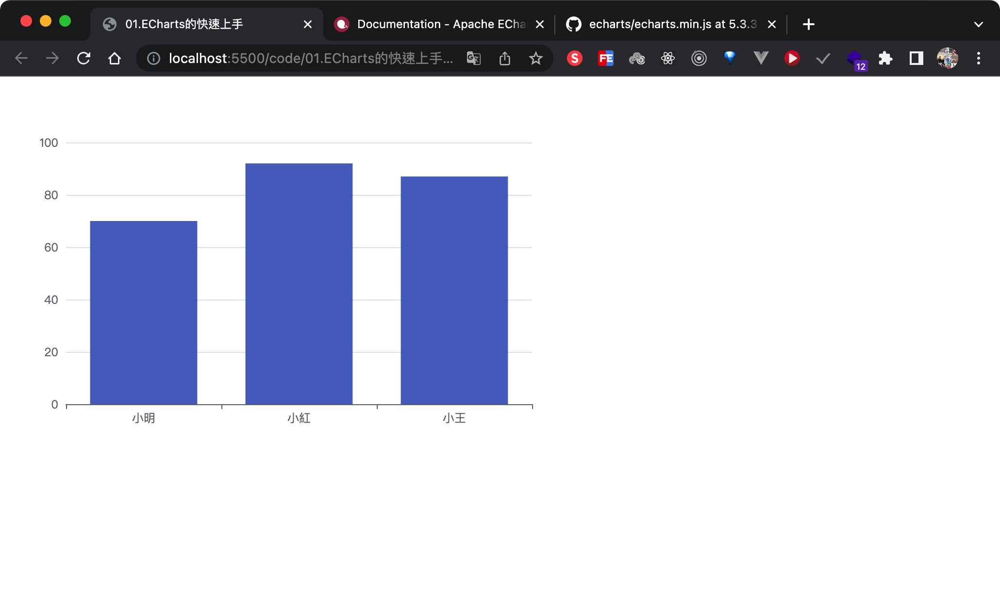

# 02.配置項的講解和使用

[02.配置項的講解和使用](./code/02.配置項的講解和使用.html)

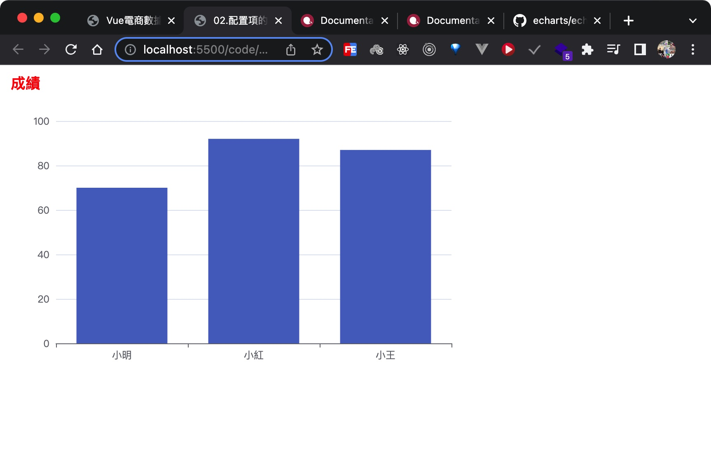

# 03.柱狀圖的實現

[03.柱狀圖的實現](./code/03.柱狀圖的實現.html)

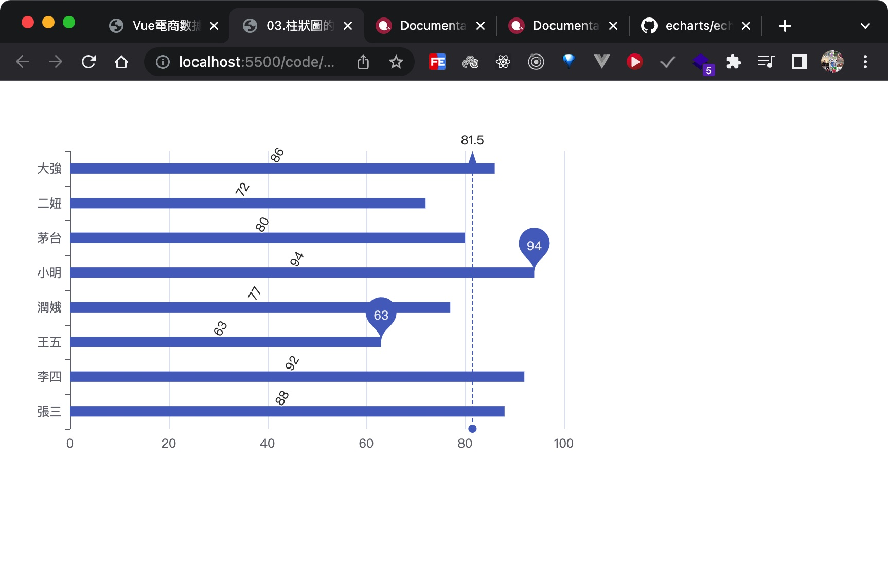

# 04.通用配置01

[04.通用配置01](./code/04.通用配置01.html)

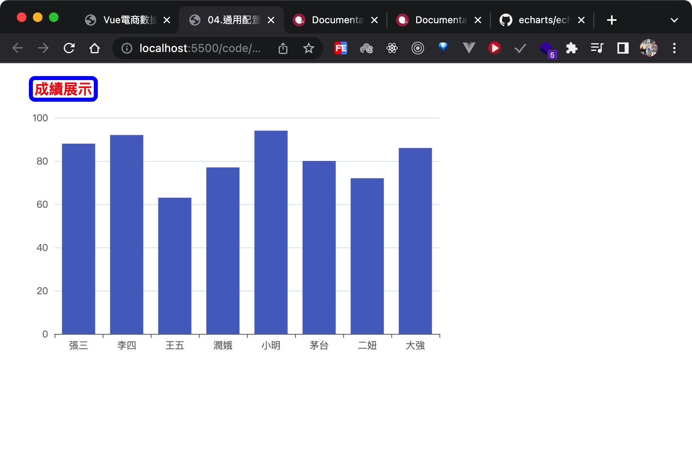

# 05.通用配置02

[05.通用配置02](./code/05.通用配置02.html)

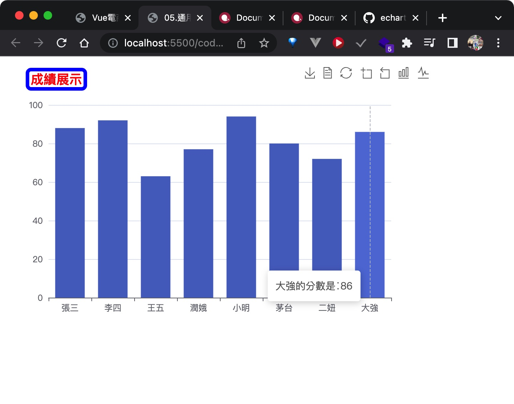

# 06.通用配置03

[06.通用配置03](./code/06.通用配置03.html)

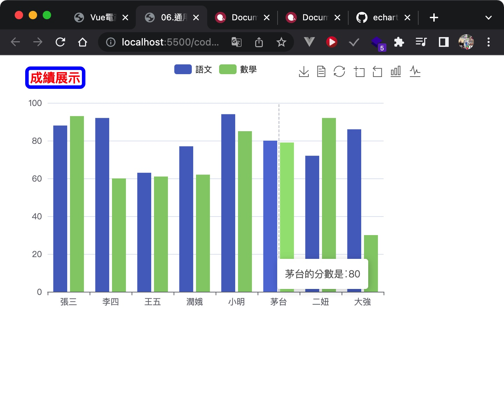

# 07.折線圖的實現

[07.折線圖的實現](./code/07.折線圖的實現.html)

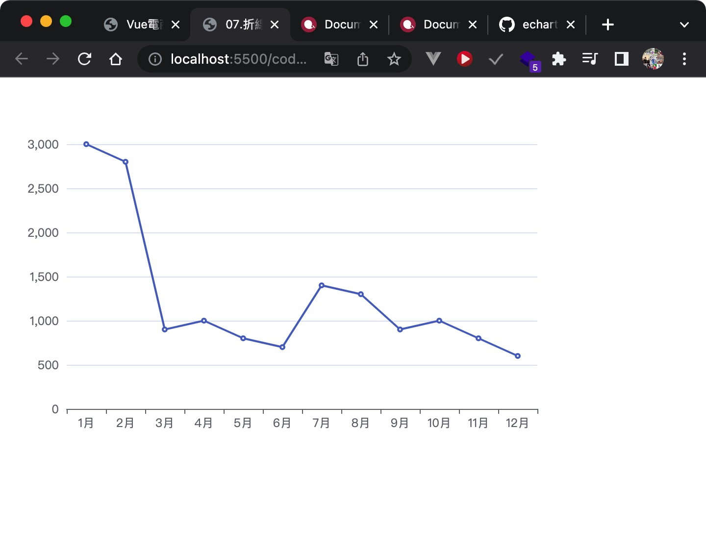

# 08.折線圖的常見效果

[08.折線圖的常見效果](./code/08.折線圖的常見效果.html)

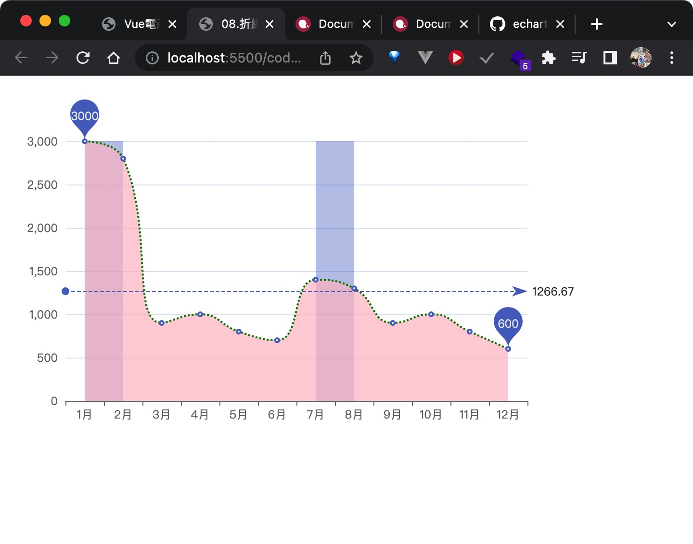

# 09.折線圖的常見效果02

[09.折線圖的常見效果02](./code/09.折線圖的常見效果02.html)

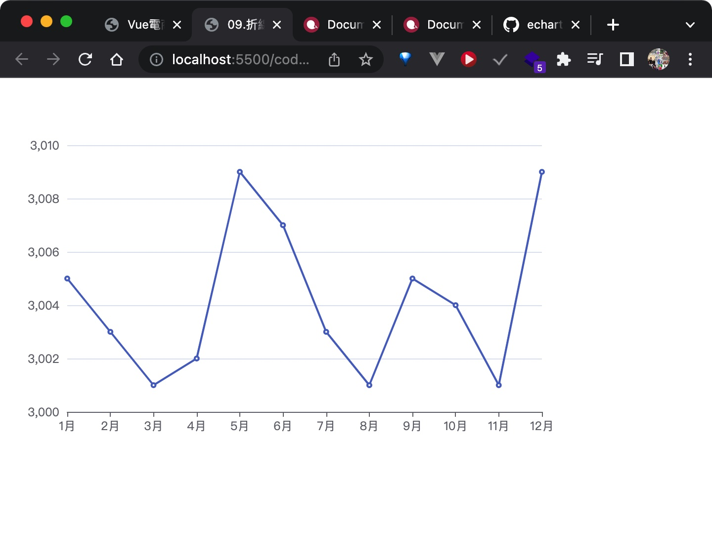

# 10.折線圖的常見效果_堆疊圖

[10.折線圖的常見效果_堆疊圖](./code/10.折線圖的常見效果_堆疊圖.html)

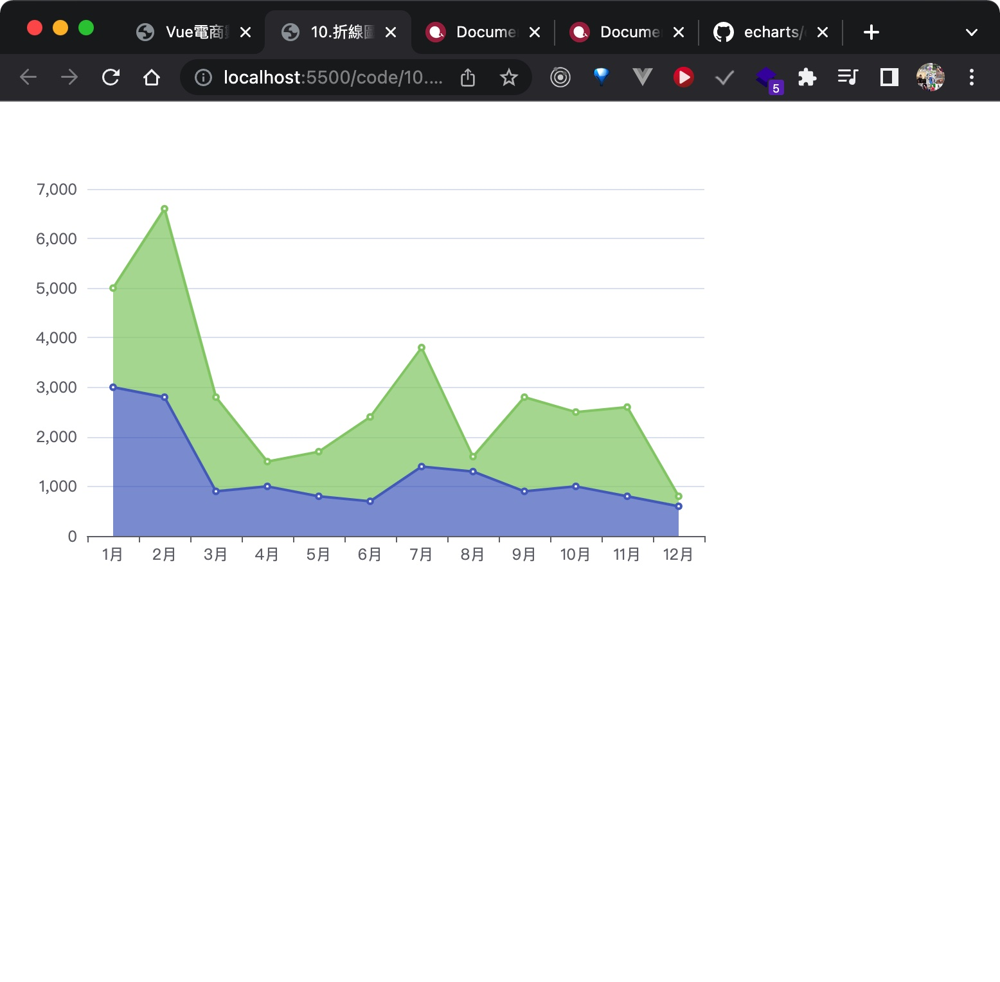

# 11.散點圖的實現

[11.散點圖的實現](./code/11.散點圖的實現.html)

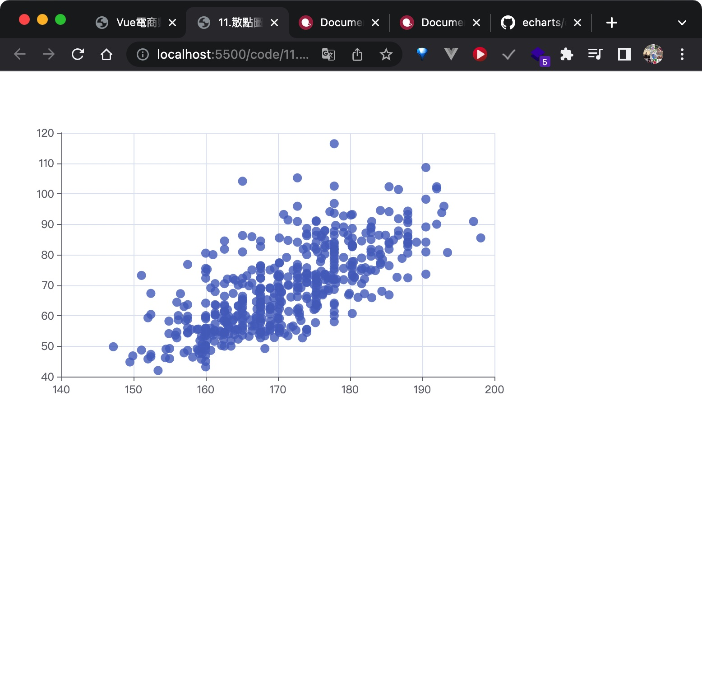

